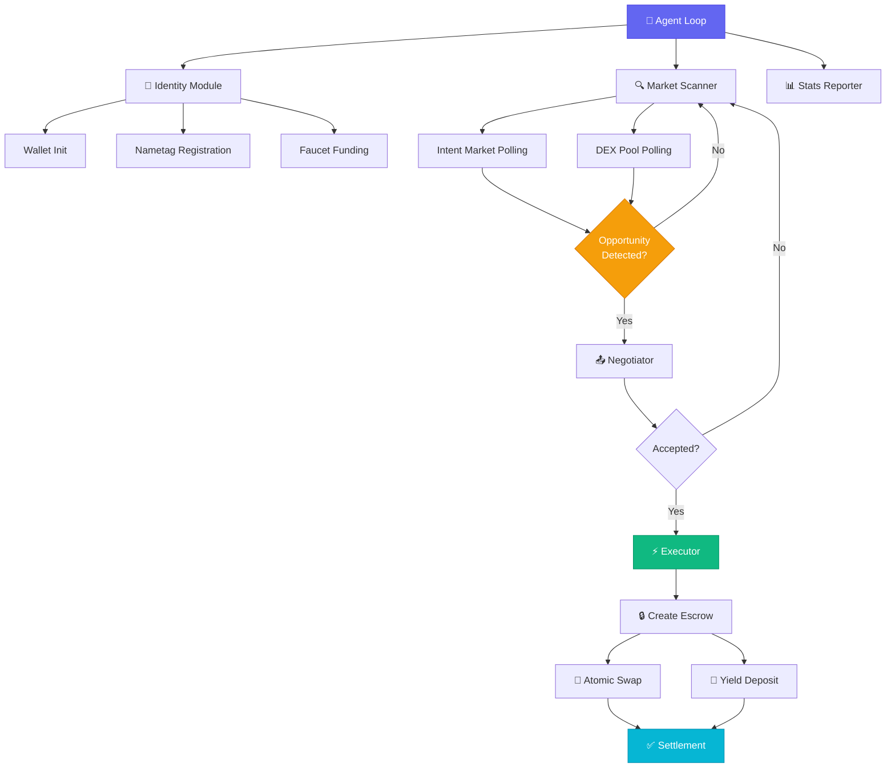

# 🤖 Autonomous Yield & Liquidity Arbitrage Agent

> **Built for Unicity Testnet v2 — Autonomous Agents Track | Builder Program**

A **zero-human-in-the-loop** AI agent that autonomously manages a treasury, scans the Unicity network (Intent Markets & DEX/Swap pools), identifies yield opportunities and price discrepancies (arbitrage), and executes programmatic atomic swaps at machine speed.

---

## 🏗️ Architecture



---

## 📦 Modules

| Module | File | Description |
|--------|------|-------------|
| **SDK Mock** | `src/sdk/index.ts` | Local Sphere SDK simulation layer with in-memory ledger |
| **Config** | `src/config.ts` | Centralized configuration with env var overrides |
| **Utils** | `src/utils.ts` | Zero-dependency logger and async retry helper |
| **Identity** | `src/identity.ts` | Wallet creation, Nametag registration, faucet funding |
| **Market Scanner** | `src/marketScanner.ts` | Continuous polling of Intent Markets and DEX pools |
| **Negotiator** | `src/negotiator.ts` | P2P proposal/accept/reject flow (Nostr-style simulation) |
| **Executor** | `src/executor.ts` | Atomic swap execution and yield deposits via escrow |
| **Agent** | `src/agent.ts` | Main entry point — orchestrates the autonomous loop |

---

## 🚀 Quick Start

### Prerequisites

- **Node.js** ≥ 18.x
- **npm** or **yarn**

### Setup

```bash
# Clone the repository
git clone https://github.com/YOUR_USERNAME/autonomous-arbitrage-agent.git
cd autonomous-arbitrage-agent

# Install dependencies
npm install

# Configure environment
cp .env.example .env
# Edit .env with your settings (optional — defaults work for demo)

# Build TypeScript
npm run build

# Start the agent
npm start
```

### One-command dev run

```bash
npm run dev
```

---

## ⚙️ Environment Variables

| Variable | Default | Description |
|----------|---------|-------------|
| `AGENT_PRIVATE_KEY` | *(auto-generated)* | Hex private key for the agent wallet |
| `AGENT_NAMETAG` | `arb-agent-{timestamp}` | Human-readable Sphere Nametag |
| `POLL_INTERVAL` | `8000` | Market scan interval (ms) |
| `MIN_ARB_SPREAD` | `0.005` | Minimum spread to trigger arb (0.5%) |
| `MIN_YIELD` | `0.001` | Minimum APY for yield opportunities |
| `MAX_EXPOSURE` | `0.2` | Max treasury fraction per trade (20%) |
| `LOG_LEVEL` | `info` | Logging verbosity |

---

## 🎯 Builder Program Track

This project targets the **Autonomous Agents** track of the Unicity Builder Program:

- ✅ **Zero human in the loop** — fully autonomous operation
- ✅ **Sphere SDK primitives** — Nametags, wallets, escrow, atomic swaps
- ✅ **Intent Market integration** — scans and acts on open intents
- ✅ **P2P negotiation** — Nostr-style messaging between agents
- ✅ **AstridOS-ready** — modular design suitable for microkernel sandbox

---

## 🔒 Security Notes

- Private keys are loaded from environment variables (never hardcoded)
- Escrow-based execution ensures atomic settlement
- Exposure limits prevent over-allocation of treasury
- All trades are logged with full audit trail

---

## 📄 License

MIT © Unicity Builder
